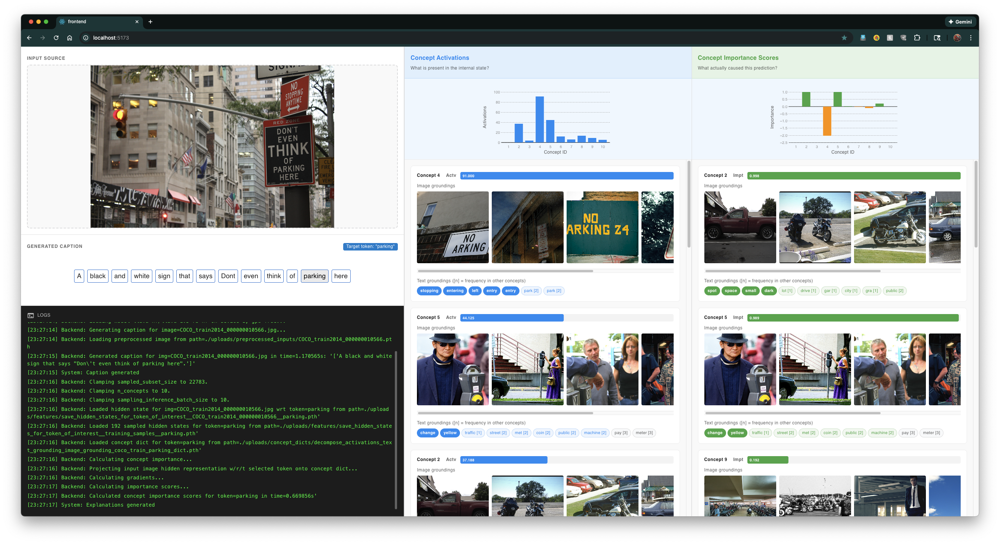

# ACRONIM: An explanation system for comparing activation vs. importance of multimodal concepts

This repository is a fork of <https://github.com/mshukor/xl-vlms>. It extends their work in <https://arxiv.org/html/2406.08074v3> to include concept importance estimation using Gradient *Concept (an adaptation of Gradient* Input to concept activation vectors learned by CoX-LMM). We provide a frontend for programmatically generating and comparing most activating/most important concept vectors; visualizing their visual and textual groundings; and utilities for computing concept attribution metrics such as C-Deletion.

This was created as a final course project for the **ECS289H - Explainable AI using Visualization** course at UC Davis, Fall 2025.

## Setup

### XL-VLM library setup

On the machine where you're hosting the backend:

1. Clone repo
2. Download MS COCO dataset. We used the 2014 train and val splits from <https://cocodataset.org/#download>.
3. Download Karpathy splits. The specific annotation file is no longer publicly available; we sourced it from <https://github.com/Delphboy/karpathy-splits>.
4. Update paths: `DATA_DIR, ANNOTATION_FILE, OUT_DIR` under `src/importance_estimation.py`
5. Install miniconda
6. Install Packages

    ```bash
    conda create --name xl_vlm python=3.9
    conda activate xl_vlm
    pip install -e .
    conda install -c bioconda perl-xml-libxml
    conda install -c conda-forge openjdk
    pip install git+https://github.com/bckim92/language-evaluation.git
    python -c "import language_evaluation; language_evaluation.download('coco')"
    import nltk
    nltk.download('words')
    ```

7. Set `HF_HOME` environment variable to whatever directory you'd like to store model caches in.

### Backend server setup (FastAPI + Uvicorn)

On the same machine where you set up the XL-VLM library (as above):

1. `conda activate xl_vlm`
2. `pip install fastapi uvicorn`
3. `uvicorn main:app --host 0.0.0.0 --port 8000 --reload`

4. If you are hosting the backend on a separate server with GPU compute, you may need to run this in a terminal on the machine where you're hosting the frontend:

    `ssh -fNT -L 8000:localhost:8000 username@server.address`

    This starts the `ssh` tunnel in the background. To close the tunnel, find the ssh PID with:

        ps aux | head -1; ps aux | grep "ssh -L"

    then

        kill <PID>

On the frontend:

5. Visit `http://localhost:8000/docs`. You should see the autogenerated SwaggerUI doc page.

### Frontend setup (Vite + React)

From project root:

```bash
cd frontend/
npm install
npm run dev
```

## Usage

Frontend was tested on an M3 Macbook Pro. Backend was run on an x86-64 remote server running Ubuntu 20.04.6 LTS, with a Quadro RTX 8000 GPU with 48GB of VRAM.

Note that even with this amount of compute some operations take a long time to complete. As such, the number of concepts, inference batch size, and inference sampling size have all been adjusted so that the system runs in minutes instead of hours. Despite this, below a minimum number of inference samples, explanation performance (number of concepts generated, diversity in concepts, etc.) plummets. You may want to adjust the parameters passed in `App.jsx` for either performance or speed.

Any reusable intermediate calculations are cached. Initial inference runs may take anywhere from 5-15 minutes depending on settings. Further inference of the same image/tokens will be considerably faster, if not instant.

### Frontend dashboard



The dashboard is accessible at `http://localhost:5173`. Usage is as follows:

- Upload an image by clicking on, or dragging and dropping into, the box on the top left. A caption will be generated for the image on upload.
- The generated caption will be displayed in the left-middle box, split into a list of words. Click on a word to generate concept-based explanations for it.

- Generated explanations will be displayed on the right. The left column visualizes concept activation scores, while the right visualizes concept importance scores.
  - A bar chart is generated that displays the concept scores across concept IDs (indices).
    - Bars are color coded. For activation scores, positive scores indicated by blue bars, and negative scores by red bars; for importance scores, positive scores are indicated by green bars, and negative scores are indicated by orange bars.
    - Clicking on a bar will scroll the concept card stack to the corresponding concept.
  - Each concept is shown on a card below the bar chart.
    - Concept cards are sorted by the absolute value of the scores, in descending order.
    - A horizontal bar indicates the concept's score as % of the max score. This is color coded in the same fashion as the bar chart bars.
    - Each concept's visual and textual groundings are displayed for reference.
    - Image groundings are clickable and opens the full image in a new tab.
    - Textual groundings are sorted by uniqueness among concepts. `Token [n]` indicates that the token appeared `n` other times in the textual groundings of other learned concepts.

- Some of these operations take a long time to complete, depending on batch and sampling sizes. A log panel in the bottom left displays progress and notifies of any processing errors.

### API testing (SwaggerUI)

You can manually test the endpoints for running concept importance estimation and calculating metrics using the autogenerated SwaggerUI interface. With the server running, navigate to `http://localhost:8000/docs`. From here you can manually run the endpoints:

- `/upload`: Upload image to server. Returns basename of saved file.
- `/caption-image'`: Get caption for image previously uploaded.
- `/importance-estimation`: Run importance estimation for captioned image with respect to a target token.
- `/instance-metrics`: Generate faithfulness metrics and plots for an importance estimation instance (input image + target token in generated caption).
- `/dataset-metrics`: Generate faithfulness metrics and plots over the whole dataset. Metrics are calculated by averaging the faithfulness of `num_eval_samples`  importance estimation instances for each token specified in `tokens`, where each concept dictionary learns `n_concepts` concepts.
